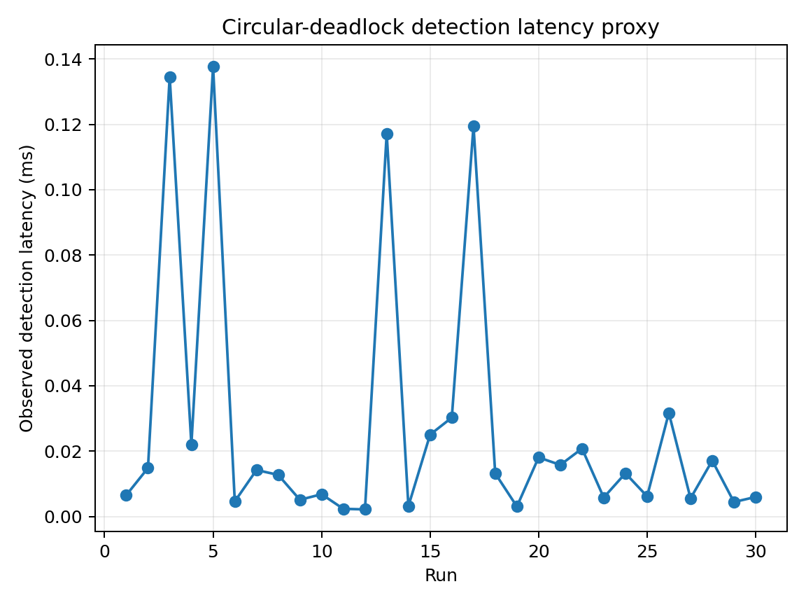
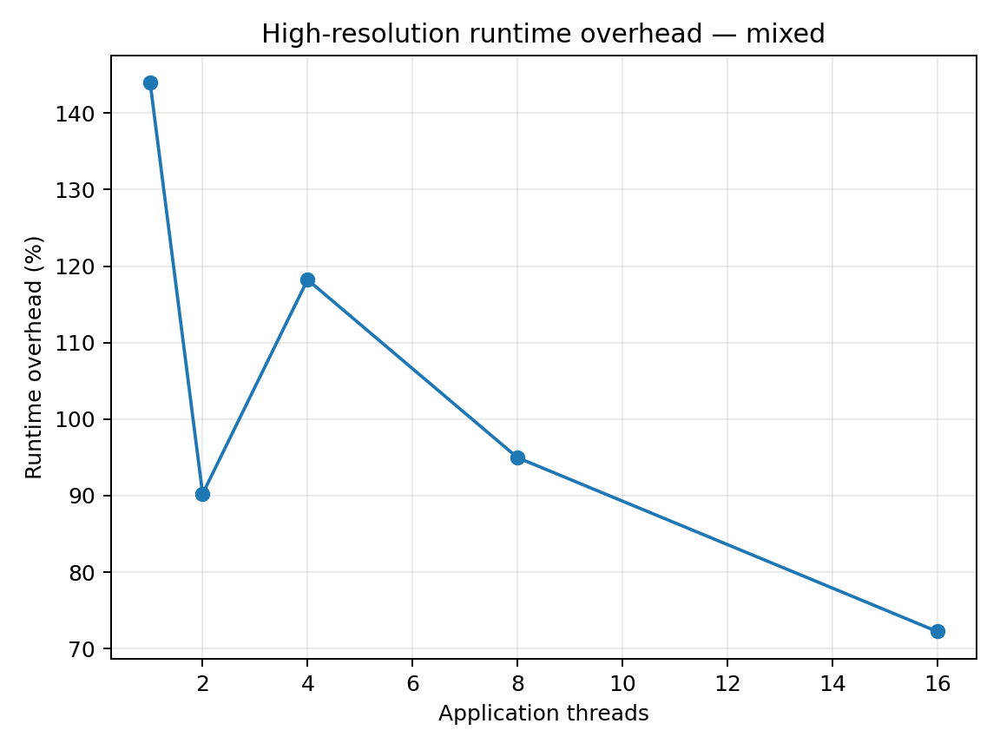
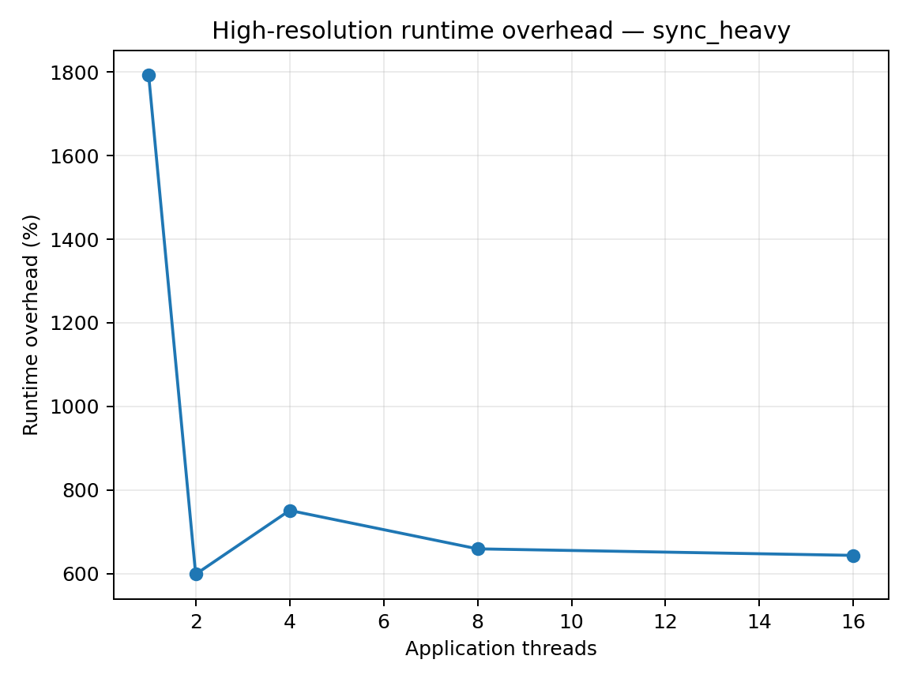
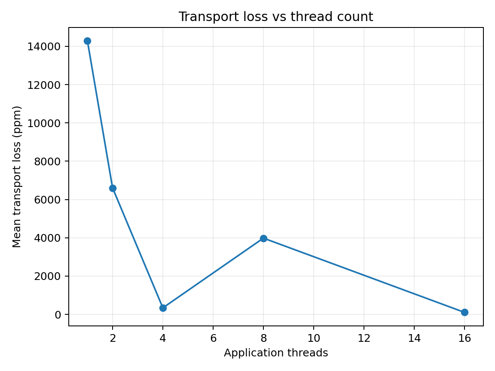

# Practical Runtime Monitoring of Safety Properties in Concurrent Embedded Software

A lightweight runtime-monitoring framework for detecting synchronization-safety violations in concurrent Linux/POSIX applications.

The project transparently intercepts POSIX mutex operations, converts synchronization activity into bounded runtime events, transfers those events asynchronously through per-thread lock-free SPSC queues, and verifies mutex/thread state in a dedicated monitor thread.


---

## Table of Contents

- [Overview](#overview)
- [Motivation](#motivation)
- [Scope](#scope)
- [Architecture](#architecture)
- [Detected Safety Properties](#detected-safety-properties)
- [Event Model](#event-model)
- [Transport Layer](#transport-layer)
- [Trace Integrity and Gap Handling](#trace-integrity-and-gap-handling)
- [Deadlock Detection](#deadlock-detection)
- [Project Structure](#project-structure)
- [Build](#build)
- [Running the Monitor](#running-the-monitor)
- [Configuration](#configuration)
- [Targets](#targets)
- [Tests](#tests)
- [Evaluation](#evaluation)
- [Experimental Results](#experimental-results)
- [Design Decisions](#design-decisions)
- [Known Limitations](#known-limitations)
- [Future Work](#future-work)
- [References](#references)

---

# Overview

The monitor observes `pthread_mutex_*` operations at runtime using `LD_PRELOAD`.

The target application is not modified internally. Instead, a shared library intercepts mutex calls such as:

```c
pthread_mutex_lock(...)
pthread_mutex_unlock(...)
```

The interceptor records events including:

- lock requests;
- successful acquisitions;
- failed acquisitions;
- successful unlocks;
- failed unlocks;
- thread start;
- thread exit.

These events are transferred asynchronously to a verifier thread.

The verifier reconstructs:

- current mutex ownership;
- thread wait state;
- per-thread held locks;
- a wait-for graph;
- thread lifecycle state;
- lock holding duration;
- trace-integrity state.

The monitor can then detect synchronization-safety violations without performing expensive verification logic directly in the intercepted application call.

---

# Motivation

Concurrency bugs are often difficult to reproduce because they depend on execution order, scheduling, timing, and contention.

Examples include:

- two threads waiting indefinitely for one another;
- a thread releasing a mutex it does not own;
- a thread requesting a mutex it already owns;
- a thread terminating while a mutex is still held;
- a critical section holding a mutex longer than an allowed threshold.

Traditional testing may not reliably expose these situations.

Runtime monitoring provides a complementary approach:

1. observe the real execution;
2. reconstruct synchronization state;
3. check safety properties while the program is running;
4. report violations when sufficient evidence exists.

This project focuses on doing that while keeping the instrumentation bounded and asynchronous.

---

# Scope

The current implementation targets:

- Linux;
- POSIX threads;
- `pthread_mutex_*` synchronization;
- embedded-Linux-style concurrent software;
- runtime detection rather than recovery.

The current implementation does **not** attempt to detect:

- arbitrary memory data races;
- race conditions without observable mutex misuse;
- condition-variable protocol errors;
- semaphore misuse;
- read-write-lock misuse;
- general application logic errors;
- AUTOSAR Classic synchronization semantics;
- generic RTOS synchronization APIs.

The monitor is intentionally scoped to synchronization-safety properties that can be inferred from the observed POSIX mutex event stream.

---

# Architecture

The project is organized conceptually into five layers.

```text
+------------------------------------------------------+
| L1 - Concurrent target applications                  |
+------------------------------------------------------+
                         |
                         v
+------------------------------------------------------+
| L2 - LD_PRELOAD pthread mutex interception           |
|      - pthread_mutex_lock                            |
|      - pthread_mutex_unlock                          |
+------------------------------------------------------+
                         |
                         v
+------------------------------------------------------+
| L3 - Bounded event transport                         |
|      - one SPSC queue per application thread         |
|      - one monitor consumer                          |
|      - DROP_NEW overflow policy                      |
+------------------------------------------------------+
                         |
                         v
+------------------------------------------------------+
| L4 - Runtime verifier                                |
|      - mutex ownership                               |
|      - waiting state                                 |
|      - wait-for graph                                |
|      - lifecycle checks                              |
|      - hold-time checks                              |
|      - trace tainting                                |
+------------------------------------------------------+
                         |
                         v
+------------------------------------------------------+
| L5 - Experimental evaluation                         |
|      - correctness                                   |
|      - overhead                                      |
|      - transport loss                                |
|      - scalability                                   |
|      - detection latency                             |
+------------------------------------------------------+
```

---

# Detected Safety Properties

## 1. `DEADLOCK_CYCLE`

Detects a directed cycle in the thread wait-for graph.

Example:

```text
T1 waits for mutex B owned by T2
T2 waits for mutex A owned by T1
```

Equivalent wait-for graph:

```text
T1 -> T2
T2 -> T1
```

This is reported as:

```text
DEADLOCK_CYCLE
```

---

## 2. `NON_OWNER_UNLOCK`

Detects an unlock operation rejected because the calling thread does not own the mutex.

The deterministic test uses an error-checking mutex so that the underlying pthread implementation returns `EPERM`.

Example:

```text
Thread A owns mutex M
Thread B calls pthread_mutex_unlock(M)
```

Result:

```text
NON_OWNER_UNLOCK
```

---

## 3. `SELF_DEADLOCK_CANDIDATE`

Detects a thread requesting a mutex that it is already known to hold.

This is deliberately reported as a **candidate** rather than an unconditional deadlock because POSIX mutex behavior depends on the mutex type.

For example:

- normal mutex;
- recursive mutex;
- error-checking mutex.

The monitor therefore avoids making a stronger claim than the available information supports.

---

## 4. `LOCK_HELD_AT_THREAD_EXIT`

Detects a thread terminating while the verifier still has authoritative evidence that the thread owns one or more mutexes.

Example:

```text
Thread T locks mutex M
Thread T exits without unlocking M
```

Result:

```text
LOCK_HELD_AT_THREAD_EXIT
```

---

## 5. `HOLD_TIME_VIOLATION`

Detects a mutex being held longer than a configured threshold.

For a lock acquired at:

```text
t_acquire
```

and released at:

```text
t_unlock
```

the holding duration is:

```text
t_hold = t_unlock - t_acquire
```

A violation is reported when:

```text
t_hold > configured_threshold
```

---

# Event Model

The runtime uses a fixed-size event structure.

Conceptually, each event contains:

```text
global sequence ID
timestamp
thread ID
object address
event type
pthread result
flags
per-thread sequence number
```

The current event size is:

```text
48 bytes
```

The event representation is intentionally fixed-size to keep queue storage bounded and predictable.

Typical event types include:

```text
THREAD_START
THREAD_EXIT
LOCK_REQUEST
LOCK_ACQUIRED
LOCK_FAILED
UNLOCKED
UNLOCK_FAILED
```

A normal successful critical section produces:

```text
LOCK_REQUEST
LOCK_ACQUIRED
UNLOCKED
```

This means:

```text
3 synchronization events per successful lock/unlock cycle
```

plus lifecycle events.

---

# Transport Layer

## Why not one global SPSC queue?

A single-producer/single-consumer queue is only correct when there is exactly:

- one producer;
- one consumer.

A concurrent application normally has several application threads producing monitoring events.

Therefore a single global SPSC queue would violate the SPSC model.

The project instead uses:

```text
one SPSC queue per application thread
one dedicated monitor consumer
```

Conceptually:

```text
Application Thread 0 ----> SPSC Queue 0 ---\
Application Thread 1 ----> SPSC Queue 1 ----\
Application Thread 2 ----> SPSC Queue 2 -----+--> Monitor Consumer
Application Thread 3 ----> SPSC Queue 3 ----/
...
```

Each queue has a single producer: its application thread.

The verifier thread is the single consumer of all registered queues.

---

## Queue Configuration

Current frozen configuration:

```text
Queue capacity       : 2048 events
Drain batch          : 64 events
Overflow policy      : DROP_NEW
Event size           : 48 bytes
Per-thread context   : approximately 98.6 KiB
Maximum contexts     : 16
```

Approximate bounded context allocation:

```text
98,624 bytes x 16
= 1,577,984 bytes
~ 1.5 MiB
```

Additional global verifier/runtime state exists, but the dominant queue/context allocation remains statically bounded.

---

## Overflow Policy

The monitor uses:

```text
DROP_NEW
```

When a producer encounters a full queue:

1. the new monitoring event is not inserted;
2. a dropped-event counter is incremented;
3. the target application continues.

The monitor does **not** wait for space.

This was a deliberate design choice.

The alternative—blocking the application until the monitor catches up—could modify application timing and scheduling and therefore interfere with the behavior being observed.

---

# Trace Integrity and Gap Handling

Event loss matters because runtime verification relies on the observed event stream.

For example, if an `UNLOCKED` event is lost, the verifier may incorrectly believe that the thread still owns a mutex.

Without explicit loss handling, a later normal lock request could then be misclassified.

The final design therefore treats trace integrity as a first-class concern.

---

## Per-thread Sequence Numbers

Every producer maintains a local event sequence number.

The sequence number is incremented **before** attempting queue insertion.

Example generated sequence:

```text
10
11
12
13
```

If event `12` is dropped and the verifier later receives:

```text
10
11
13
```

the verifier can detect a local discontinuity.

---

## Tainted Thread Streams

When a sequence discontinuity is observed, the affected thread stream is marked as:

```text
TAINTED
```

The verifier then avoids making state-dependent assertions based on uncertain thread history.

The taint operation clears or invalidates state such as:

- waiting mutex;
- held-mutex set;
- ownership derived from the uncertain stream.

This prevents stale state from generating false violations.

---

## Global Trace Completeness

Local sequence gaps are not sufficient to detect every form of loss.

For example, terminal events may be dropped with no later event arriving to reveal the sequence discontinuity.

Therefore the transport layer also maintains:

```text
generated
consumed
dropped
```

and checks:

```text
generated = consumed + dropped
```

A trace is only considered complete when:

```text
dropped events        = 0
unregistered events   = 0
lifecycle failures    = 0
transport invariant   = PASS
```

The final result is therefore classified as:

```text
Trace integrity: COMPLETE
```

or:

```text
Trace integrity: DEGRADED
```

When degraded, absence conclusions are provisional.

---

# Deadlock Detection

The verifier reconstructs a wait-for graph.

If:

```text
T1 waits for mutex M2
M2 is owned by T2
```

then the graph contains:

```text
T1 -> T2
```

A deadlock is present when the graph contains a directed cycle.

Example:

```text
T1 -> T2
T2 -> T1
```

---

## Why graph analysis is not performed on every event

An early implementation performed expensive graph checking too frequently.

That significantly reduced monitor throughput and caused large queue loss under synchronization-heavy workloads.

The final implementation therefore separates:

```text
fast state update
```

from:

```text
more expensive graph analysis
```

The consumer performs deadlock checking only when it reaches an idle/quiescent observation point.

To reduce transient false reports, a cycle must remain visible across consecutive idle observations without an intervening consumed event.

This works well for persistent circular deadlocks while keeping per-event processing inexpensive.

---

# Project Structure

A typical repository layout is:

```text
runtime-monitor/
|
+-- include/
|   +-- monitor_event.h
|   +-- ...
|
+-- src/
|   +-- interceptor.c
|   +-- monitor_runtime.c
|   +-- monitor_verifier.c
|   +-- ring_buffer.c
|
+-- targets/
|   +-- correct/
|   +-- circular_deadlock/
|   +-- non_owner_unlock/
|   +-- self_deadlock/
|   +-- held_at_exit/
|   +-- hold_time/
|   +-- benchmark_mutex/
|
+-- tests/
|   +-- test_ring_buffer.c
|
+-- scripts/
|   +-- run_l5_all.sh
|   +-- run_l5_evaluation.py
|
+-- analysis/
|   +-- analyze_l5.py
|
+-- docs/
|   +-- figures/
|       +-- deadlock_detection_latency.png
|       +-- runtime_overhead_mixed.png
|       +-- runtime_overhead_sync_heavy.png
|       +-- transport_loss_vs_threads.png
|
+-- results/
|   +-- l5/
|
+-- CMakeLists.txt
+-- README.md
```

Generated build directories are intentionally omitted from the logical source-tree description.

---

# Build

Requirements:

- Linux;
- GCC or another compatible C compiler;
- CMake;
- POSIX threads;
- Python 3 for evaluation scripts.

A normal Release build:

```bash
cmake -S . -B build-release -DCMAKE_BUILD_TYPE=Release
cmake --build build-release -j
```

A Debug build can be created with:

```bash
cmake -S . -B build-debug -DCMAKE_BUILD_TYPE=Debug
cmake --build build-debug -j
```

---

# Running the Monitor

The monitor is loaded with `LD_PRELOAD`.

General pattern:

```bash
LD_PRELOAD="./build-release/lib/libmonitor.so" \
./build-release/bin/<target>
```

Example:

```bash
LD_PRELOAD="./build-release/lib/libmonitor.so" \
./build-release/bin/non_owner_unlock
```

---

## Circular Deadlock Target

The circular deadlock intentionally never terminates by itself.

Run it with a timeout:

```bash
timeout 3s env \
LD_PRELOAD="./build-release/lib/libmonitor.so" \
./build-release/bin/circular_deadlock
```

A successful experiment should print a live:

```text
[monitor][VIOLATION] DEADLOCK_CYCLE
```

and `timeout` should terminate the deadlocked target.

The shell exit status is expected to be:

```text
124
```

because the timeout utility terminates the deadlocked process.

---

# Configuration

## Debug Output

If supported by the current build, runtime debugging can be enabled with:

```bash
MONITOR_DEBUG=1
```

Example:

```bash
MONITOR_DEBUG=1 \
LD_PRELOAD="./build-release/lib/libmonitor.so" \
./build-release/bin/correct_mutex
```

---

## Maximum Lock Holding Time

The hold-time detector can be configured through:

```bash
MONITOR_MAX_HOLD_NS
```

Example:

```bash
MONITOR_MAX_HOLD_NS=100000000 \
LD_PRELOAD="./build-release/lib/libmonitor.so" \
./build-release/bin/hold_time
```

This configures:

```text
100,000,000 ns
= 100 ms
```

A value of:

```text
0
```

disables hold-time detection.

---

# Targets

## Correct Mutex Workload

A multi-threaded counter increment protected by a mutex.

Expected result:

```text
Synchronization correct
No safety violations
```

The workload is used both as a correctness target and as a source of high synchronization traffic.

---

## Circular Deadlock

Two threads acquire two mutexes in opposite order.

Conceptually:

```text
Thread 1:
    lock A
    wait
    lock B

Thread 2:
    lock B
    wait
    lock A
```

Expected monitor result:

```text
DEADLOCK_CYCLE
```

---

## Non-owner Unlock

One thread owns a mutex while another attempts to unlock it.

Expected result:

```text
NON_OWNER_UNLOCK
```

---

## Self-deadlock Candidate

A thread attempts to lock a mutex it already owns.

Expected result:

```text
SELF_DEADLOCK_CANDIDATE
```

---

## Lock Held at Thread Exit

A worker locks a mutex and returns without releasing it.

Expected result:

```text
LOCK_HELD_AT_THREAD_EXIT
```

---

## Hold-time Violation

A thread deliberately holds a mutex longer than the configured threshold.

Expected result:

```text
HOLD_TIME_VIOLATION
```

---

## Configurable Benchmark

The benchmark supports:

```bash
benchmark_mutex \
    --threads N \
    --iterations N \
    --work N
```

Parameters:

```text
--threads
    Number of worker threads

--iterations
    Critical-section iterations per worker

--work
    Amount of deterministic arithmetic work
    performed while the mutex is held
```

Examples:

Synchronization-heavy:

```bash
./build-release/bin/benchmark_mutex \
    --threads 4 \
    --iterations 100000 \
    --work 0
```

Mixed workload:

```bash
./build-release/bin/benchmark_mutex \
    --threads 4 \
    --iterations 100000 \
    --work 100
```

---

# Tests

The SPSC queue includes dedicated tests for:

```text
basic FIFO behavior
bounded capacity
wraparound
concurrent SPSC operation
```

Run the CTest suite with:

```bash
ctest --test-dir build-release --output-on-failure
```

---

# Evaluation

The project includes an automated L5 evaluation suite.

Run the quick pipeline:

```bash
./scripts/run_l5_all.sh --quick
```

The quick configuration is intended to validate the evaluation pipeline.

The full experiment:

```bash
./scripts/run_l5_all.sh
```

The full evaluation includes:

- repeated correctness experiments;
- baseline versus monitored timing;
- synchronization-heavy and mixed profiles;
- 1, 2, 4, 8, and 16 application threads;
- stress/scalability measurements;
- event-loss measurements;
- maximum RSS measurements;
- deadlock detection-latency proxy;
- CSV generation;
- Markdown summary generation;
- plots.

---

## Correctness Methodology

Each target is executed:

```text
30 times
```

The evaluation separates:

```text
behavioral correctness
```

from:

```text
trace authority
```

This distinction is important.

A clean workload may correctly produce:

```text
0 violations
```

while transport loss prevents the monitor from making an authoritative statement that no violation occurred.

---

## Performance Methodology

Each performance configuration executes:

```text
400,000 total critical sections
```

Two profiles are used.

### Synchronization-heavy

```text
work = 0
```

This is intentionally pessimistic.

Almost all target execution consists of synchronization operations.

### Mixed

```text
work = 100
```

This includes deterministic computation inside the critical section.

Thread counts:

```text
1
2
4
8
16
```

Each configuration includes warm-up runs followed by repeated baseline and monitored measurements.

The execution order alternates between baseline-first and monitor-first runs to reduce systematic temporal bias.

---

## Primary Timing Metric

The primary performance metric is the benchmark's:

```text
target_elapsed_ns
```

measured using:

```text
CLOCK_MONOTONIC_RAW
```

Runtime overhead is computed as:

```text
(mean monitored time - mean baseline time)
------------------------------------------------ x 100%
             mean baseline time
```

`/usr/bin/time` wall time is retained as a secondary metric because its resolution is too coarse for the shortest synchronization-heavy baseline runs.

---

# Experimental Results

## Correctness

Observed behavioral results:

```text
Injected fault detections:
150 / 150 = 100%

Clean runs with zero false violations:
30 / 30 = 100%

Overall expected behavioral outcomes:
180 / 180 = 100%
```

The five supported violation categories were reproduced successfully across repeated executions.

The clean target produced no false violations.

Some clean runs experienced queue loss and were therefore downgraded from authoritative to provisional.

This is a transport-completeness limitation, not a false-positive result.

---

## Deadlock Detection

Circular deadlock:

```text
30 / 30 live detections
```

Observed host-side detection-latency proxy:

```text
mean    ~ 0.027 ms
median  ~ 0.013 ms
p95     ~ 0.128 ms
maximum < 0.14 ms
```

<p align="center">
  
</p>

<p align="center">
  <em>Figure 1 — Observed circular-deadlock detection-latency proxy across 30 repeated executions.</em>
</p>

The latency value is deliberately described as a **proxy** because it includes observation and scheduling effects around target and monitor output.

---

## Mixed Workload Runtime Overhead

Approximate high-resolution overhead:

| Threads | Overhead |
|---:|---:|
| 1 | 144% |
| 2 | 90% |
| 4 | 118% |
| 8 | 95% |
| 16 | 72% |

<p align="center">
  
</p>

<p align="center">
  <em>Figure 2 — High-resolution runtime overhead as a function of application thread count for the mixed workload.</em>
</p>

The relative monitoring cost generally becomes smaller when useful application work forms a larger fraction of total execution time.

The result is not perfectly monotonic because scheduling, contention, cache behavior, and overlap between target and monitor execution also affect timing.

---

## Synchronization-heavy Runtime Overhead

Approximate high-resolution overhead:

| Threads | Overhead |
|---:|---:|
| 1 | 1793% |
| 2 | 598% |
| 4 | 751% |
| 8 | 659% |
| 16 | 643% |

<p align="center">
  
</p>

<p align="center">
  <em>Figure 3 — High-resolution runtime overhead as a function of application thread count for the synchronization-heavy workload.</em>
</p>

These values are intentionally a worst-case microbenchmark.

The baseline executes extremely quickly, while each successful critical section generates approximately three synchronization-monitor events.

The very large percentages must therefore be interpreted together with the absolute cost.

Across the evaluated configurations, the additional elapsed time was approximately:

```text
188 to 291 ms
```

for:

```text
400,000 critical sections
```

Equivalent effective normalization:

```text
~471 to 729 ns added elapsed time per critical section
```

and approximately:

```text
~157 to 243 ns effective added elapsed time per generated event
```

The per-event figure is an aggregate normalization, not the execution latency of an individual event.

---

## Transport Loss

Under stress, mean loss was workload and scheduling dependent.

Representative results:

| Threads | Mean Transport Loss |
|---:|---:|
| 1 | ~1.43% |
| 2 | ~0.66% |
| 4 | ~0.034% |
| 8 | ~0.40% |
| 16 | ~0.010% |

<p align="center">
  
</p>

<p align="center">
  <em>Figure 4 — Mean event-transport loss as a function of application thread count during the stress experiment.</em>
</p>

The relationship is clearly not monotonic with thread count.

This indicates that queue overflow depends more directly on:

```text
instantaneous producer event rate
relative to
monitor consumer drain rate
```

than on thread count alone.

Contention can reduce producer burstiness by causing application threads to wait or be descheduled.

---

## False Violations Under Load

A key result of the final gap-aware design is that transport degradation did not produce false state-dependent alarms.

Observed:

```text
Correctness clean false-violation runs : 0
Performance false-violation runs       : 0
Stress false-violation runs            : 0
```

The intended semantic behavior is:

```text
complete trace
    -> authoritative conclusion

incomplete trace
    -> degraded/provisional conclusion
```

rather than:

```text
incomplete trace
    -> fabricated certainty
```

---

# Design Decisions

## `LD_PRELOAD` Instead of Source Instrumentation

Advantages:

- transparent to normal target binaries;
- no changes required in application call sites;
- centralized interception logic;
- easy activation/deactivation.

Trade-off:

- limited to dynamically resolved functions;
- unsuitable for arbitrary non-POSIX synchronization without additional instrumentation.

---

## One Queue Per Producer

Chosen because SPSC queues require one producer and one consumer.

Advantages:

- no producer-side global queue lock;
- independent producer progress;
- bounded memory;
- natural per-thread accounting.

---

## `DROP_NEW` Instead of Blocking

Chosen to preserve target progress.

Advantages:

- monitor cannot stall application threads;
- bounded interference;
- predictable behavior under overload.

Trade-off:

- events can be lost;
- loss must be explicitly reflected in verification authority.

---

## Asynchronous Verification

The interceptor does not perform complex graph analysis.

Advantages:

- shorter producer hot path;
- expensive verification work moved off application threads;
- better separation between instrumentation and analysis.

---

## Gap-aware Tainting

Chosen after observing that dropped events can leave stale reconstructed ownership state.

Advantages:

- prevents stale state from creating false alarms;
- makes incomplete evidence explicit;
- preserves a conservative interpretation.

---

# Known Limitations

## Event Loss

Bounded queues can overflow.

This is intentional.

The monitor prioritizes:

```text
target progress
```

over:

```text
guaranteed lossless observation
```

Trace-integrity reporting must therefore always accompany absence claims.

---

## Terminal Loss Detection

Per-thread sequence numbers only reveal a gap when a later event is delivered.

If final events from a thread are dropped and no later event arrives, the local sequence discontinuity cannot be observed.

Global transport counters remain the authoritative source for end-to-end trace completeness.

---

## Runtime Overhead

The current implementation does **not** support a "negligible overhead" claim.

Measured overhead is substantial, especially for synchronization-dominated microbenchmarks.

The project should instead be described as:

```text
bounded
asynchronous
non-blocking
semantically conservative under loss
```

with runtime overhead reported honestly as a primary deployment trade-off.

---

## Mutex Type Awareness

The verifier does not globally reconstruct every mutex type.

For that reason, self-lock behavior is reported as:

```text
SELF_DEADLOCK_CANDIDATE
```

rather than an unconditional deadlock.

---

## Data Races

The monitor observes mutex operations.

It does not automatically detect arbitrary memory data races.

A race that occurs without an observable synchronization-safety violation can remain invisible.

---

## Platform

The implementation is intended for Linux/POSIX systems.

Evaluation numbers obtained on one development host are not timing guarantees for all embedded processors or Linux configurations.

---


# References

Useful technical references:

- Linux dynamic loader / `LD_PRELOAD`  
  https://man7.org/linux/man-pages/man8/ld.so.8.html

- `dlsym()` / `RTLD_NEXT`  
  https://man7.org/linux/man-pages/man3/dlsym.3.html

- POSIX mutex operations  
  https://pubs.opengroup.org/onlinepubs/9799919799/functions/pthread_mutex_lock.html

- Linux circular-buffer documentation  
  https://docs.kernel.org/core-api/circular-buffers.html

- Linux false-sharing documentation  
  https://docs.kernel.org/kernel-hacking/false-sharing.html

- `sched_yield()`  
  https://man7.org/linux/man-pages/man2/sched_yield.2.html

- CMake `add_library()`  
  https://cmake.org/cmake/help/latest/command/add_library.html

- CMake `target_link_libraries()`  
  https://cmake.org/cmake/help/latest/command/target_link_libraries.html

- M. Leucker and C. Schallhart,  
  *A Brief Account of Runtime Verification*,  
  Journal of Logic and Algebraic Programming, 2009.

---

